# Call Sequence Diagrams

## requestDeposit

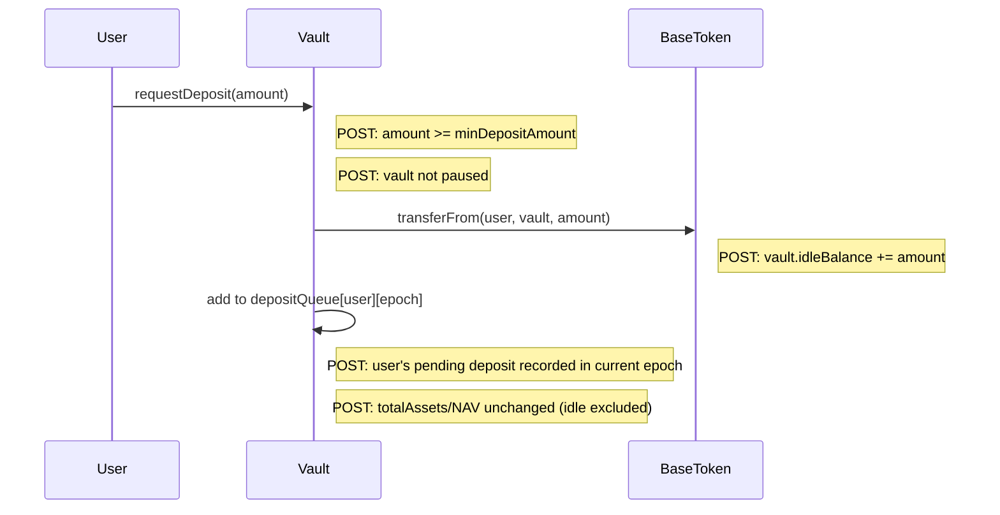

## cancelDeposit

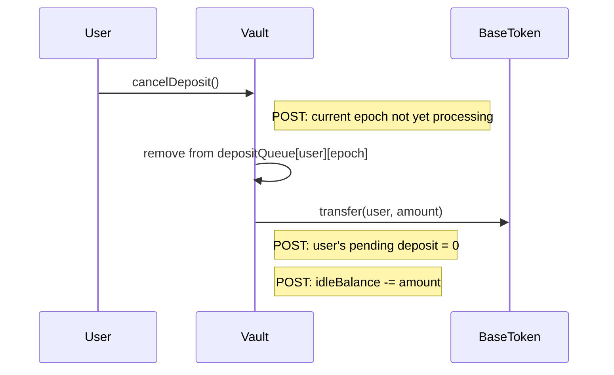

## processDepositEpoch

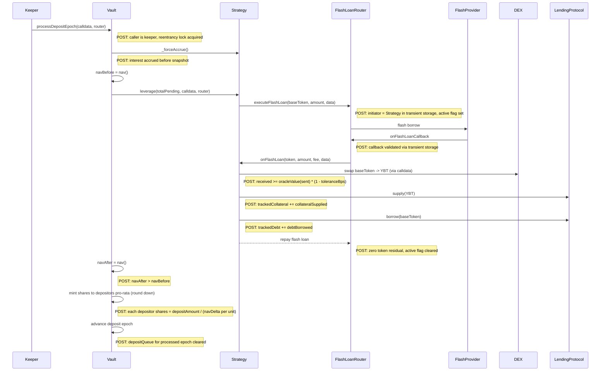

## requestWithdrawal

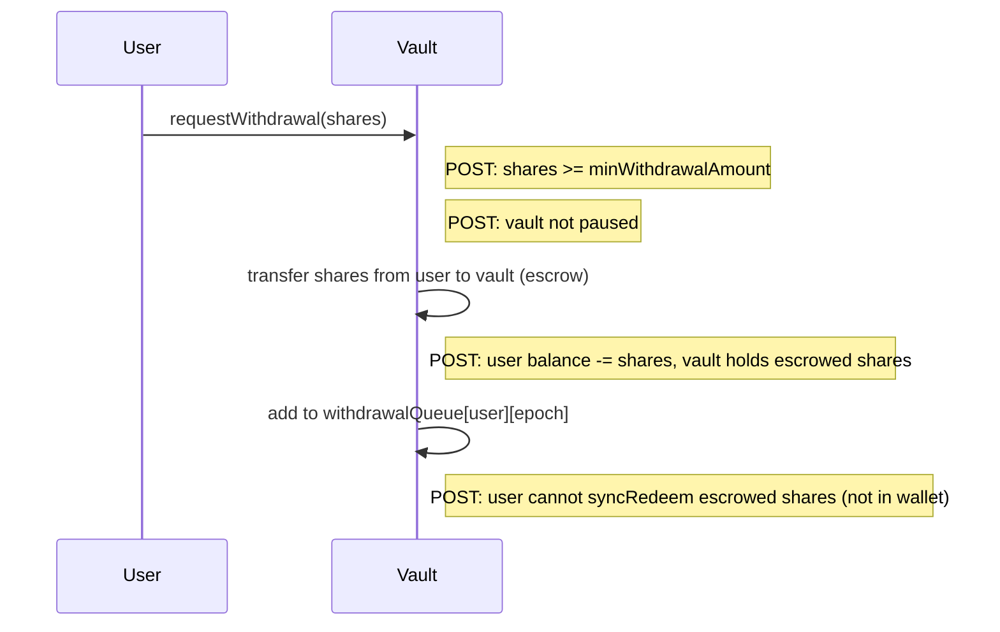

## processWithdrawalEpoch

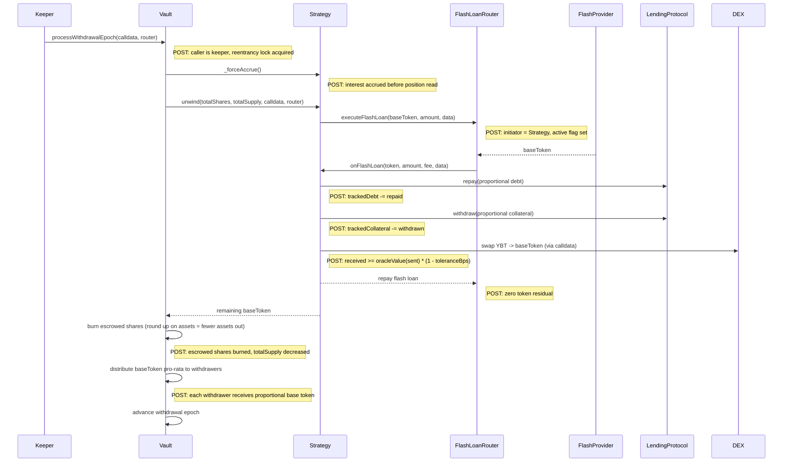

## syncRedeem

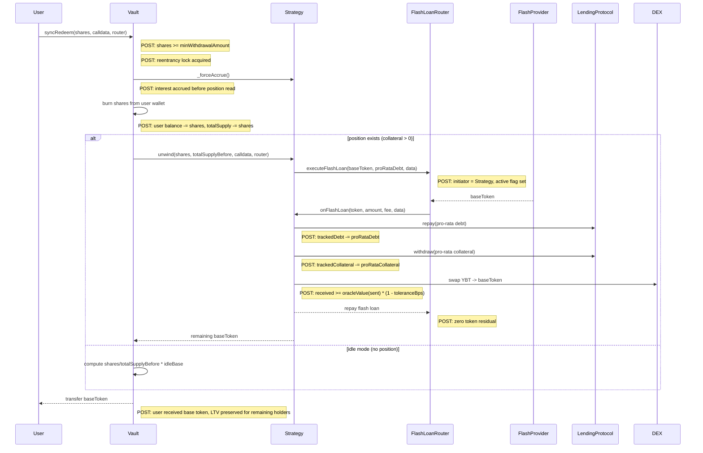

## depositCustom (migration intake)

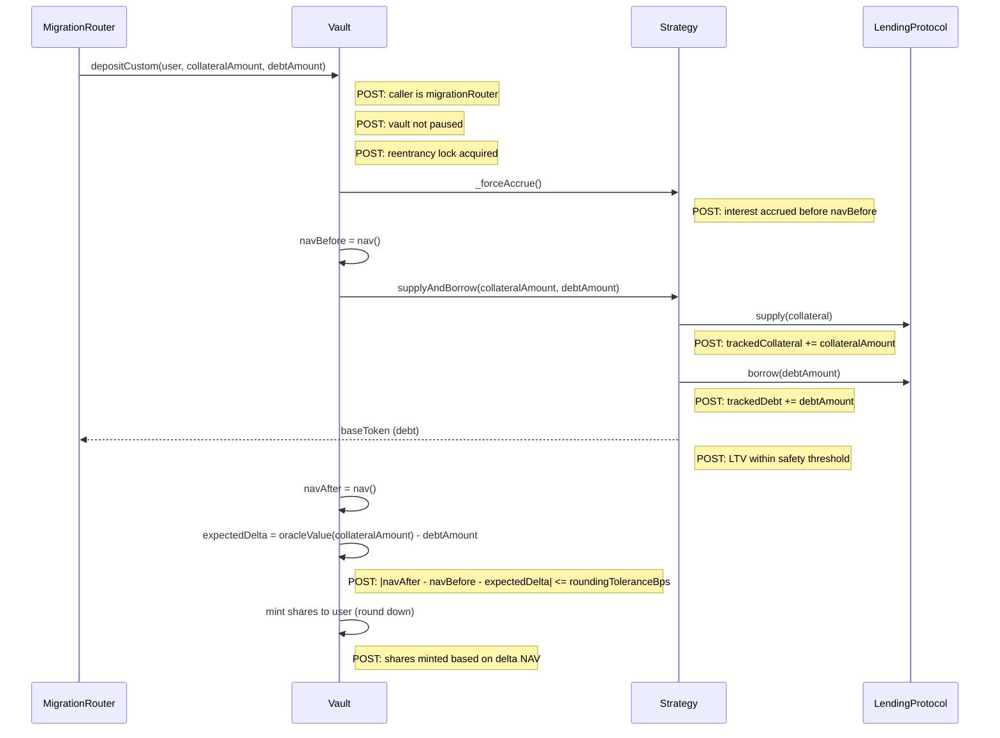

## withdrawCustom (migration source)

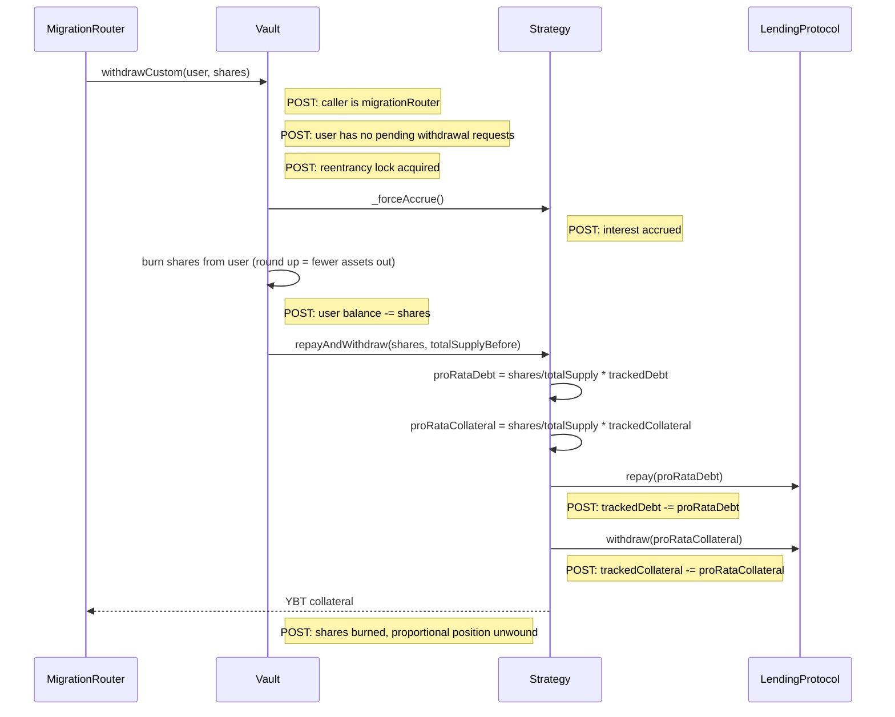

## migrate (full flow)

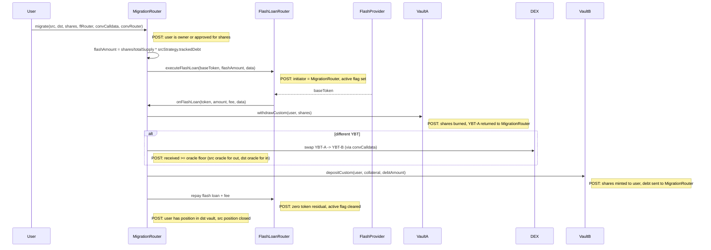

## forceUnwind

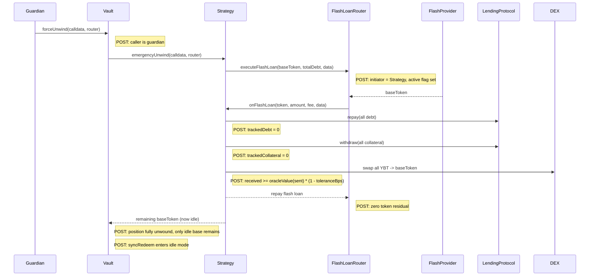

## reclaimDeposit

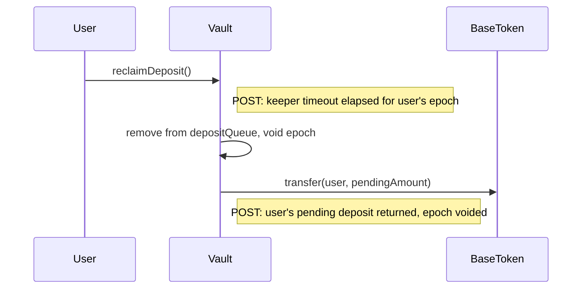

## pause

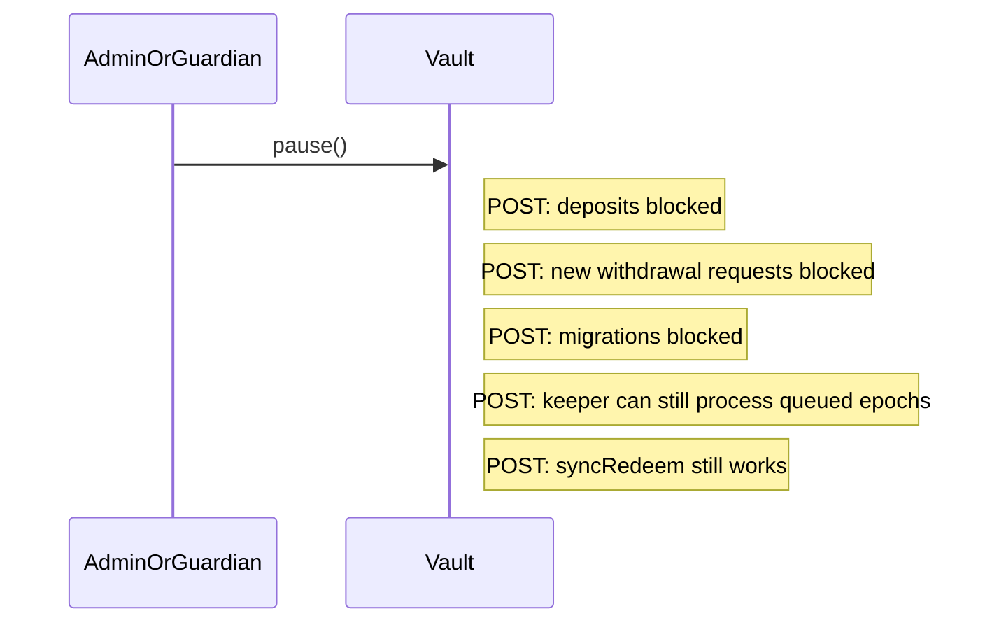

## unpause

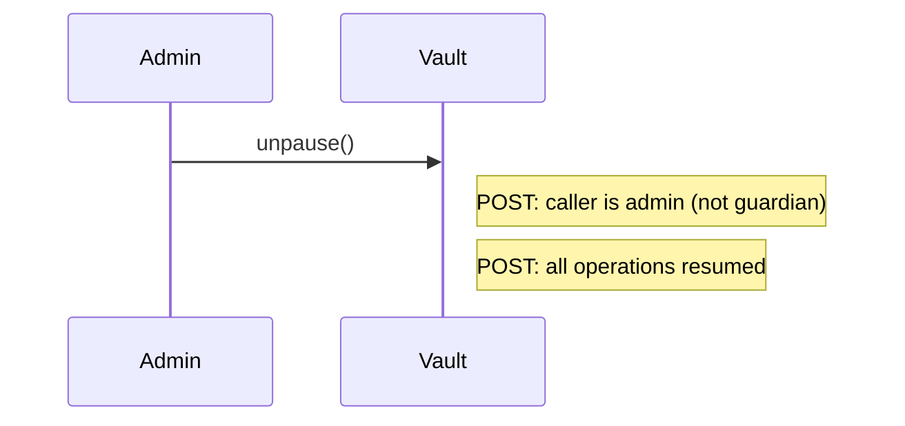

## setTolerance

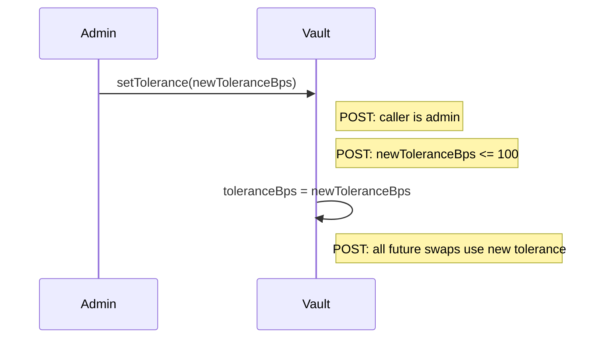

## Factory deploy

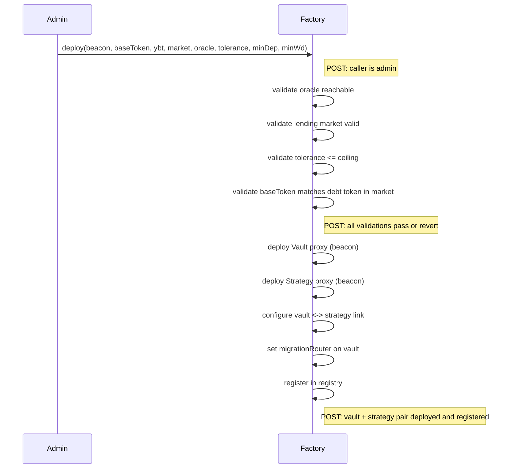
