# Call Sequence Diagrams

## requestDeposit

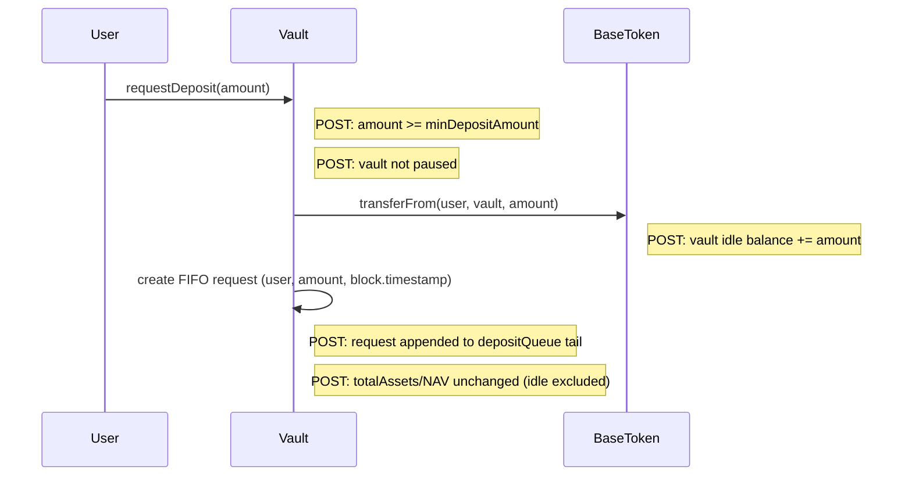
```mermaid
sequenceDiagram
    User->>Vault: requestDeposit(amount)
    note right of Vault: POST: amount >= minDepositAmount
    note right of Vault: POST: vault not paused
    Vault->>BaseToken: transferFrom(user, vault, amount)
    note right of BaseToken: POST: vault idle balance += amount
    Vault->>Vault: create FIFO request (user, amount, block.timestamp)
    note right of Vault: POST: request appended to depositQueue tail
    note right of Vault: POST: totalAssets/NAV unchanged (idle excluded)
```

## cancelDeposit

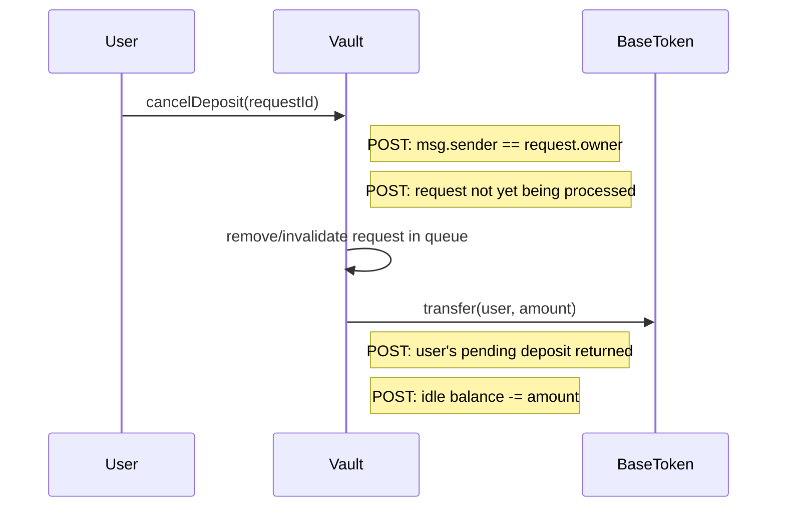
```mermaid
sequenceDiagram
    User->>Vault: cancelDeposit(requestId)
    note right of Vault: POST: msg.sender == request.owner
    note right of Vault: POST: request not yet being processed
    Vault->>Vault: remove/invalidate request in queue
    Vault->>BaseToken: transfer(user, amount)
    note right of Vault: POST: user's pending deposit returned
    note right of Vault: POST: idle balance -= amount
```

## processDeposits

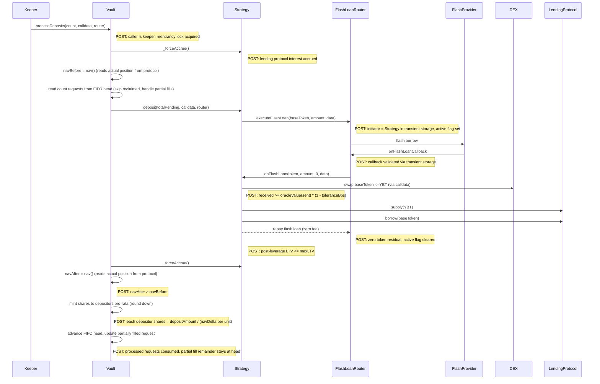
```mermaid
sequenceDiagram
    Keeper->>Vault: processDeposits(count, calldata, router)
    note right of Vault: POST: caller is keeper, reentrancy lock acquired
    Vault->>Strategy: _forceAccrue()
    note right of Strategy: POST: lending protocol interest accrued
    Vault->>Vault: navBefore = nav() (reads actual position from protocol)
    Vault->>Vault: read count requests from FIFO head (skip reclaimed, handle partial fills)
    Vault->>Strategy: deposit(totalPending, calldata, router)
    Strategy->>FlashLoanRouter: executeFlashLoan(baseToken, amount, data)
    note right of FlashLoanRouter: POST: initiator = Strategy in transient storage, active flag set
    FlashLoanRouter->>FlashProvider: flash borrow
    FlashProvider->>FlashLoanRouter: onFlashLoanCallback
    note right of FlashLoanRouter: POST: callback validated via transient storage
    FlashLoanRouter->>Strategy: onFlashLoan(token, amount, 0, data)
    Strategy->>DEX: swap baseToken -> YBT (via calldata)
    note right of Strategy: POST: received >= oracleValue(sent) * (1 - toleranceBps)
    Strategy->>LendingProtocol: supply(YBT)
    Strategy->>LendingProtocol: borrow(baseToken)
    Strategy-->>FlashLoanRouter: repay flash loan (zero fee)
    note right of FlashLoanRouter: POST: zero token residual, active flag cleared
    note right of Strategy: POST: post-leverage LTV <= maxLTV
    Vault->>Strategy: _forceAccrue()
    Vault->>Vault: navAfter = nav() (reads actual position from protocol)
    note right of Vault: POST: navAfter > navBefore
    Vault->>Vault: mint shares to depositors pro-rata (round down)
    note right of Vault: POST: each depositor shares = depositAmount / (navDelta per unit)
    Vault->>Vault: advance FIFO head, update partially filled request
    note right of Vault: POST: processed requests consumed, partial fill remainder stays at head
```

## requestRedeem

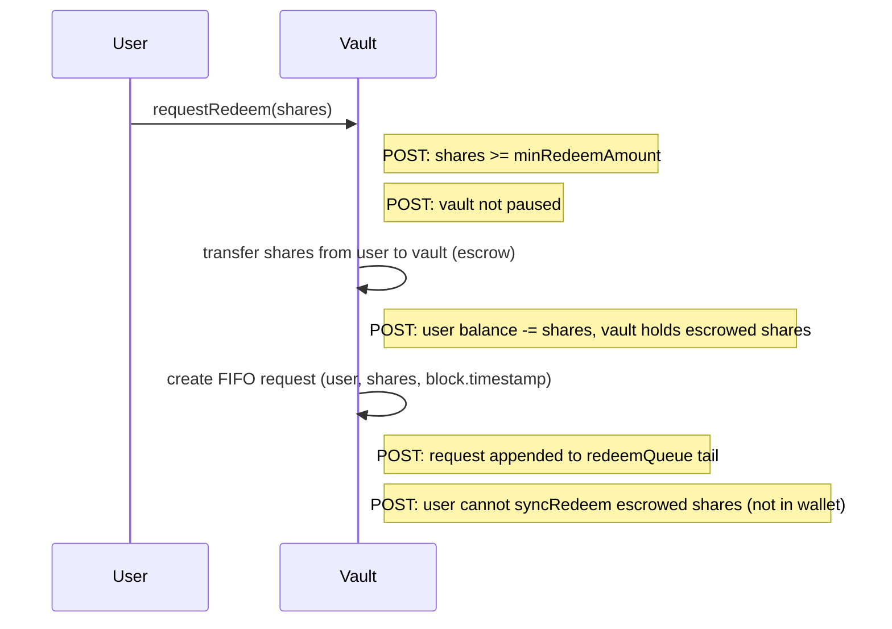
```mermaid
sequenceDiagram
    User->>Vault: requestRedeem(shares)
    note right of Vault: POST: shares >= minRedeemAmount
    note right of Vault: POST: vault not paused
    Vault->>Vault: transfer shares from user to vault (escrow)
    note right of Vault: POST: user balance -= shares, vault holds escrowed shares
    Vault->>Vault: create FIFO request (user, shares, block.timestamp)
    note right of Vault: POST: request appended to redeemQueue tail
    note right of Vault: POST: user cannot syncRedeem escrowed shares (not in wallet)
```

## processRedeems

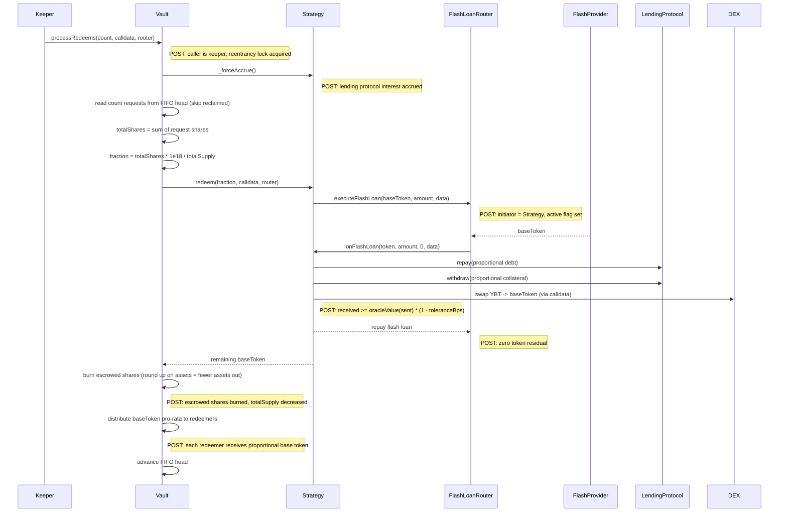
```mermaid
sequenceDiagram
    Keeper->>Vault: processRedeems(count, calldata, router)
    note right of Vault: POST: caller is keeper, reentrancy lock acquired
    Vault->>Strategy: _forceAccrue()
    note right of Strategy: POST: lending protocol interest accrued
    Vault->>Vault: read count requests from FIFO head (skip reclaimed)
    Vault->>Vault: totalShares = sum of request shares
    Vault->>Vault: fraction = totalShares * 1e18 / totalSupply
    Vault->>Strategy: redeem(fraction, calldata, router)
    Strategy->>FlashLoanRouter: executeFlashLoan(baseToken, amount, data)
    note right of FlashLoanRouter: POST: initiator = Strategy, active flag set
    FlashProvider-->>FlashLoanRouter: baseToken
    FlashLoanRouter->>Strategy: onFlashLoan(token, amount, 0, data)
    Strategy->>LendingProtocol: repay(proportional debt)
    Strategy->>LendingProtocol: withdraw(proportional collateral)
    Strategy->>DEX: swap YBT -> baseToken (via calldata)
    note right of Strategy: POST: received >= oracleValue(sent) * (1 - toleranceBps)
    Strategy-->>FlashLoanRouter: repay flash loan
    note right of FlashLoanRouter: POST: zero token residual
    Strategy-->>Vault: remaining baseToken
    Vault->>Vault: burn escrowed shares (round up on assets = fewer assets out)
    note right of Vault: POST: escrowed shares burned, totalSupply decreased
    Vault->>Vault: distribute baseToken pro-rata to redeemers
    note right of Vault: POST: each redeemer receives proportional base token
    Vault->>Vault: advance FIFO head
```

## syncRedeem

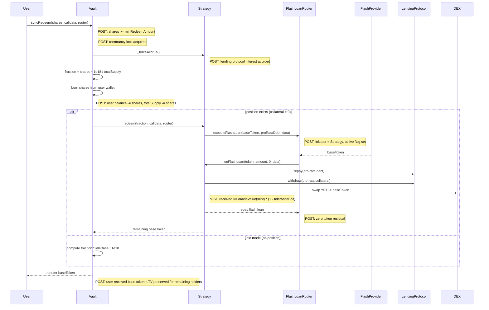
```mermaid
sequenceDiagram
    User->>Vault: syncRedeem(shares, calldata, router)
    note right of Vault: POST: shares >= minRedeemAmount
    note right of Vault: POST: reentrancy lock acquired
    Vault->>Strategy: _forceAccrue()
    note right of Strategy: POST: lending protocol interest accrued
    Vault->>Vault: fraction = shares * 1e18 / totalSupply
    Vault->>Vault: burn shares from user wallet
    note right of Vault: POST: user balance -= shares, totalSupply -= shares
    alt position exists (collateral > 0)
        Vault->>Strategy: redeem(fraction, calldata, router)
        Strategy->>FlashLoanRouter: executeFlashLoan(baseToken, proRataDebt, data)
        note right of FlashLoanRouter: POST: initiator = Strategy, active flag set
        FlashProvider-->>FlashLoanRouter: baseToken
        FlashLoanRouter->>Strategy: onFlashLoan(token, amount, 0, data)
        Strategy->>LendingProtocol: repay(pro-rata debt)
        Strategy->>LendingProtocol: withdraw(pro-rata collateral)
        Strategy->>DEX: swap YBT -> baseToken
        note right of Strategy: POST: received >= oracleValue(sent) * (1 - toleranceBps)
        Strategy-->>FlashLoanRouter: repay flash loan
        note right of FlashLoanRouter: POST: zero token residual
        Strategy-->>Vault: remaining baseToken
    else idle mode (no position)
        Vault->>Vault: compute fraction * idleBase / 1e18
    end
    Vault-->>User: transfer baseToken
    note right of Vault: POST: user received base token, LTV preserved for remaining holders
```

## reclaimDeposit

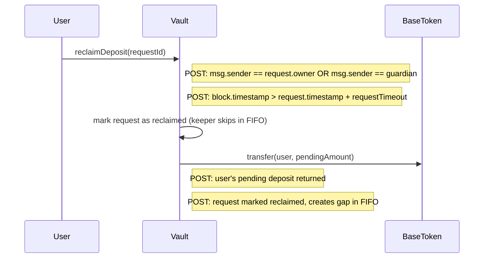
```mermaid
sequenceDiagram
    User->>Vault: reclaimDeposit(requestId)
    note right of Vault: POST: msg.sender == request.owner OR msg.sender == guardian
    note right of Vault: POST: block.timestamp > request.timestamp + requestTimeout
    Vault->>Vault: mark request as reclaimed (keeper skips in FIFO)
    Vault->>BaseToken: transfer(user, pendingAmount)
    note right of Vault: POST: user's pending deposit returned
    note right of Vault: POST: request marked reclaimed, creates gap in FIFO
```

## reclaimRedeem

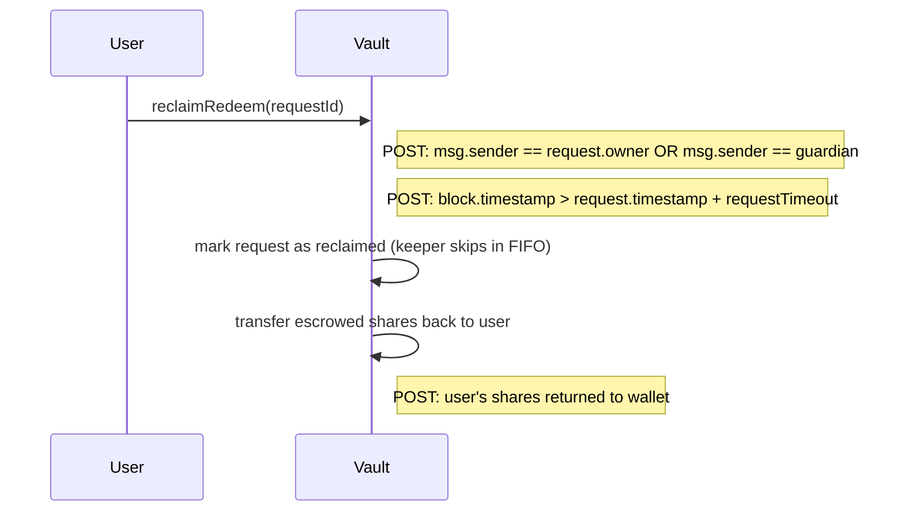
```mermaid
sequenceDiagram
    User->>Vault: reclaimRedeem(requestId)
    note right of Vault: POST: msg.sender == request.owner OR msg.sender == guardian
    note right of Vault: POST: block.timestamp > request.timestamp + requestTimeout
    Vault->>Vault: mark request as reclaimed (keeper skips in FIFO)
    Vault->>Vault: transfer escrowed shares back to user
    note right of Vault: POST: user's shares returned to wallet
```

## depositCustom (migration intake)

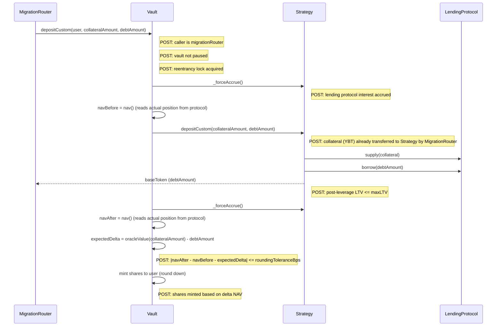
```mermaid
sequenceDiagram
    MigrationRouter->>Vault: depositCustom(user, collateralAmount, debtAmount)
    note right of Vault: POST: caller is migrationRouter
    note right of Vault: POST: vault not paused
    note right of Vault: POST: reentrancy lock acquired
    Vault->>Strategy: _forceAccrue()
    note right of Strategy: POST: lending protocol interest accrued
    Vault->>Vault: navBefore = nav() (reads actual position from protocol)
    Vault->>Strategy: depositCustom(collateralAmount, debtAmount)
    note right of Strategy: POST: collateral (YBT) already transferred to Strategy by MigrationRouter
    Strategy->>LendingProtocol: supply(collateral)
    Strategy->>LendingProtocol: borrow(debtAmount)
    Strategy-->>MigrationRouter: baseToken (debtAmount)
    note right of Strategy: POST: post-leverage LTV <= maxLTV
    Vault->>Strategy: _forceAccrue()
    Vault->>Vault: navAfter = nav() (reads actual position from protocol)
    Vault->>Vault: expectedDelta = oracleValue(collateralAmount) - debtAmount
    note right of Vault: POST: |navAfter - navBefore - expectedDelta| <= roundingToleranceBps
    Vault->>Vault: mint shares to user (round down)
    note right of Vault: POST: shares minted based on delta NAV
```

## redeemCustom (migration source)

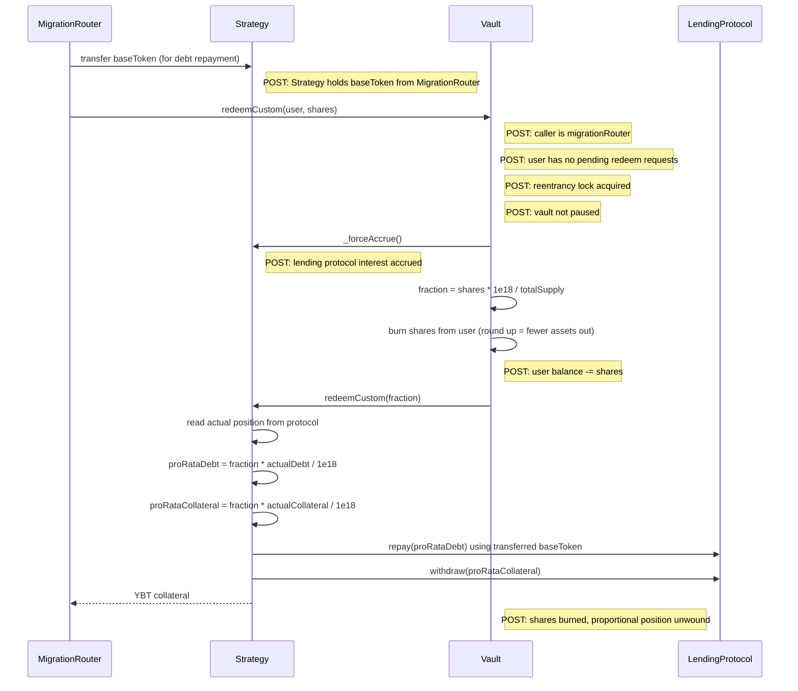
```mermaid
sequenceDiagram
    MigrationRouter->>Strategy: transfer baseToken (for debt repayment)
    note right of Strategy: POST: Strategy holds baseToken from MigrationRouter
    MigrationRouter->>Vault: redeemCustom(user, shares)
    note right of Vault: POST: caller is migrationRouter
    note right of Vault: POST: user has no pending redeem requests
    note right of Vault: POST: reentrancy lock acquired
    note right of Vault: POST: vault not paused
    Vault->>Strategy: _forceAccrue()
    note right of Strategy: POST: lending protocol interest accrued
    Vault->>Vault: fraction = shares * 1e18 / totalSupply
    Vault->>Vault: burn shares from user (round up = fewer assets out)
    note right of Vault: POST: user balance -= shares
    Vault->>Strategy: redeemCustom(fraction)
    Strategy->>Strategy: read actual position from protocol
    Strategy->>Strategy: proRataDebt = fraction * actualDebt / 1e18
    Strategy->>Strategy: proRataCollateral = fraction * actualCollateral / 1e18
    Strategy->>LendingProtocol: repay(proRataDebt) using transferred baseToken
    Strategy->>LendingProtocol: withdraw(proRataCollateral)
    Strategy-->>MigrationRouter: YBT collateral
    note right of Vault: POST: shares burned, proportional position unwound
```

## migrate (full flow)

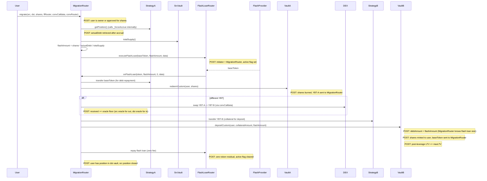
```mermaid
sequenceDiagram
    User->>MigrationRouter: migrate(src, dst, shares, flRouter, convCalldata, convRouter)
    note right of MigrationRouter: POST: user is owner or approved for shares
    MigrationRouter->>StrategyA: getPosition() (calls _forceAccrue internally)
    note right of MigrationRouter: POST: actualDebt retrieved after accrual
    MigrationRouter->>SrcVault: totalSupply()
    MigrationRouter->>MigrationRouter: flashAmount = shares * actualDebt / totalSupply
    MigrationRouter->>FlashLoanRouter: executeFlashLoan(baseToken, flashAmount, data)
    note right of FlashLoanRouter: POST: initiator = MigrationRouter, active flag set
    FlashProvider-->>FlashLoanRouter: baseToken
    FlashLoanRouter->>MigrationRouter: onFlashLoan(token, flashAmount, 0, data)
    MigrationRouter->>StrategyA: transfer baseToken (for debt repayment)
    MigrationRouter->>VaultA: redeemCustom(user, shares)
    note right of VaultA: POST: shares burned, YBT-A sent to MigrationRouter
    alt different YBT
        MigrationRouter->>DEX: swap YBT-A -> YBT-B (via convCalldata)
        note right of MigrationRouter: POST: received >= oracle floor (src oracle for out, dst oracle for in)
    end
    MigrationRouter->>StrategyB: transfer YBT-B (collateral for deposit)
    MigrationRouter->>VaultB: depositCustom(user, collateralAmount, flashAmount)
    note right of VaultB: POST: debtAmount = flashAmount (MigrationRouter knows flash loan size)
    note right of VaultB: POST: shares minted to user, baseToken sent to MigrationRouter
    note right of VaultB: POST: post-leverage LTV <= maxLTV
    MigrationRouter->>FlashLoanRouter: repay flash loan (zero fee)
    note right of FlashLoanRouter: POST: zero token residual, active flag cleared
    note right of MigrationRouter: POST: user has position in dst vault, src position closed
```

## emergencyRedeem

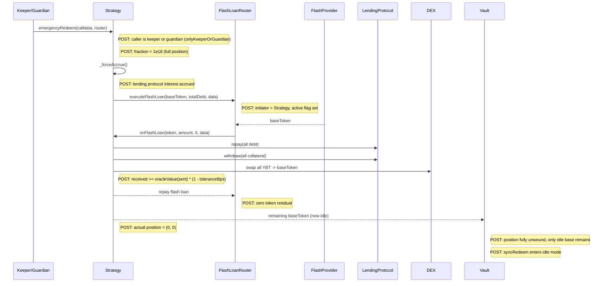
```mermaid
sequenceDiagram
    Keeper/Guardian->>Strategy: emergencyRedeem(calldata, router)
    note right of Strategy: POST: caller is keeper or guardian (onlyKeeperOrGuardian)
    note right of Strategy: POST: fraction = 1e18 (full position)
    Strategy->>Strategy: _forceAccrue()
    note right of Strategy: POST: lending protocol interest accrued
    Strategy->>FlashLoanRouter: executeFlashLoan(baseToken, totalDebt, data)
    note right of FlashLoanRouter: POST: initiator = Strategy, active flag set
    FlashProvider-->>FlashLoanRouter: baseToken
    FlashLoanRouter->>Strategy: onFlashLoan(token, amount, 0, data)
    Strategy->>LendingProtocol: repay(all debt)
    Strategy->>LendingProtocol: withdraw(all collateral)
    Strategy->>DEX: swap all YBT -> baseToken
    note right of Strategy: POST: received >= oracleValue(sent) * (1 - toleranceBps)
    Strategy-->>FlashLoanRouter: repay flash loan
    note right of FlashLoanRouter: POST: zero token residual
    Strategy-->>Vault: remaining baseToken (now idle)
    note right of Strategy: POST: actual position = (0, 0)
    note right of Vault: POST: position fully unwound, only idle base remains
    note right of Vault: POST: syncRedeem enters idle mode
```

## FlashLoanRouter.executeFlashLoan

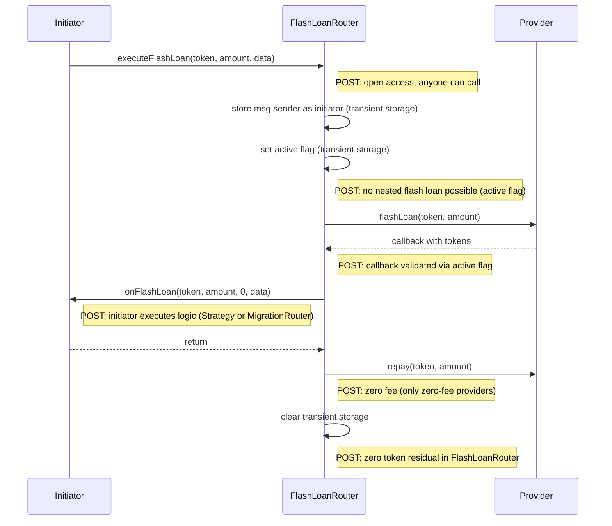
```mermaid
sequenceDiagram
    Initiator->>FlashLoanRouter: executeFlashLoan(token, amount, data)
    note right of FlashLoanRouter: POST: open access, anyone can call
    FlashLoanRouter->>FlashLoanRouter: store msg.sender as initiator (transient storage)
    FlashLoanRouter->>FlashLoanRouter: set active flag (transient storage)
    note right of FlashLoanRouter: POST: no nested flash loan possible (active flag)
    FlashLoanRouter->>Provider: flashLoan(token, amount)
    Provider-->>FlashLoanRouter: callback with tokens
    note right of FlashLoanRouter: POST: callback validated via active flag
    FlashLoanRouter->>Initiator: onFlashLoan(token, amount, 0, data)
    note right of Initiator: POST: initiator executes logic (Strategy or MigrationRouter)
    Initiator-->>FlashLoanRouter: return
    FlashLoanRouter->>Provider: repay(token, amount)
    note right of FlashLoanRouter: POST: zero fee (only zero-fee providers)
    FlashLoanRouter->>FlashLoanRouter: clear transient storage
    note right of FlashLoanRouter: POST: zero token residual in FlashLoanRouter
```

## pause

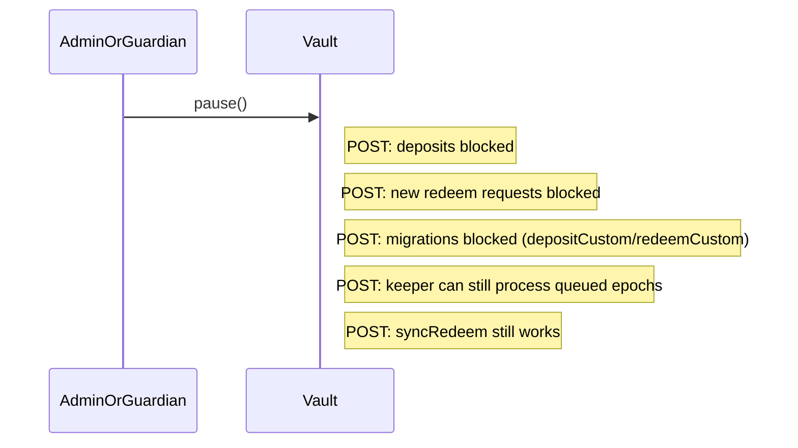
```mermaid
sequenceDiagram
    AdminOrGuardian->>Vault: pause()
    note right of Vault: POST: deposits blocked
    note right of Vault: POST: new redeem requests blocked
    note right of Vault: POST: migrations blocked (depositCustom/redeemCustom)
    note right of Vault: POST: keeper can still process queued epochs
    note right of Vault: POST: syncRedeem still works
```

## unpause

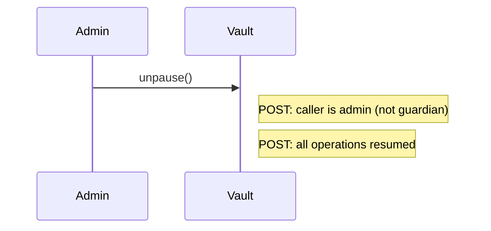
```mermaid
sequenceDiagram
    Admin->>Vault: unpause()
    note right of Vault: POST: caller is admin (not guardian)
    note right of Vault: POST: all operations resumed
```

## setTolerance

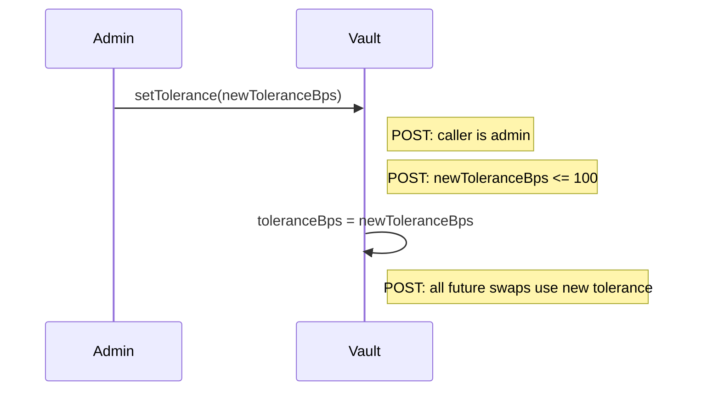
```mermaid
sequenceDiagram
    Admin->>Vault: setTolerance(newToleranceBps)
    note right of Vault: POST: caller is admin
    note right of Vault: POST: newToleranceBps <= 100
    Vault->>Vault: toleranceBps = newToleranceBps
    note right of Vault: POST: all future swaps use new tolerance
```

## Factory deploy

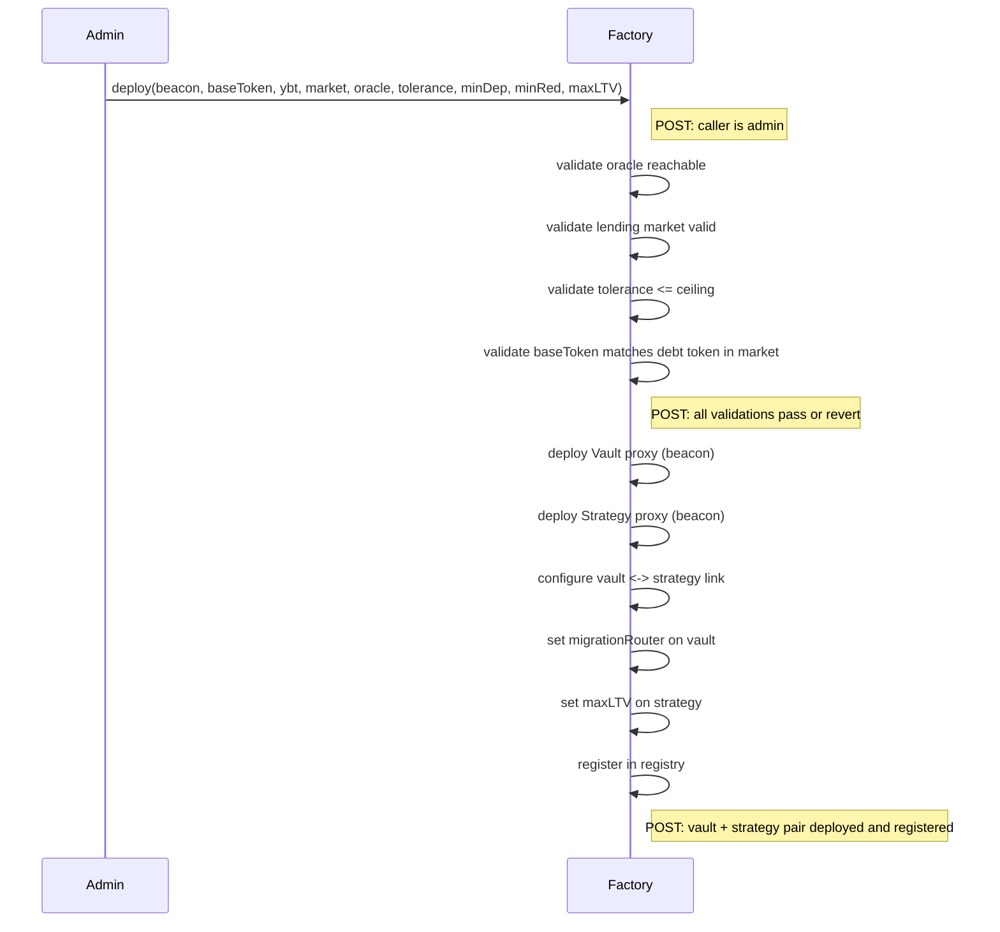
```mermaid
sequenceDiagram
    Admin->>Factory: deploy(beacon, baseToken, ybt, market, oracle, tolerance, minDep, minRed, maxLTV)
    note right of Factory: POST: caller is admin
    Factory->>Factory: validate oracle reachable
    Factory->>Factory: validate lending market valid
    Factory->>Factory: validate tolerance <= ceiling
    Factory->>Factory: validate baseToken matches debt token in market
    note right of Factory: POST: all validations pass or revert
    Factory->>Factory: deploy Vault proxy (beacon)
    Factory->>Factory: deploy Strategy proxy (beacon)
    Factory->>Factory: configure vault <-> strategy link
    Factory->>Factory: set migrationRouter on vault
    Factory->>Factory: set maxLTV on strategy
    Factory->>Factory: register in registry
    note right of Factory: POST: vault + strategy pair deployed and registered
```
