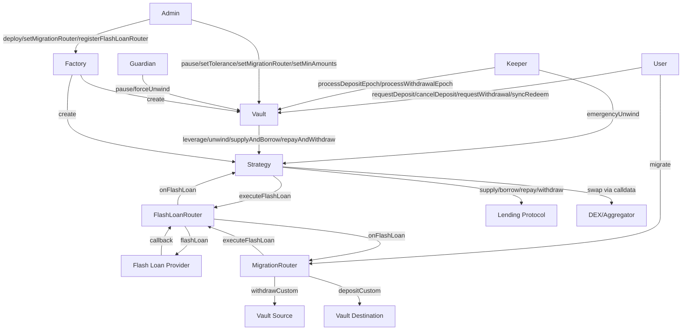

# Contract Decomposition

## Contract Table

| Contract | Responsibility | Depends on |
|----------|---------------|------------|
| Vault | User-facing accounting: ERC20 shares, epoch queues, NAV calculation, pause logic, sync redeem, reentrancy lock | Strategy, MigrationRouter (authorized caller) |
| Strategy (abstract) | Leverage orchestration: flash loan callback, swap execution, lending protocol calls, internal balance tracking | FlashLoanRouter, Lending Protocol (external) |
| AaveStrategy | Strategy implementation for Aave v3: supply, borrow, repay, withdraw, forceAccrue | Strategy, Aave v3 (external) |
| MorphoStrategy | Strategy implementation for Morpho Blue | Strategy, Morpho Blue (external) |
| EulerStrategy | Strategy implementation for Euler v2 | Strategy, Euler v2 (external) |
| FlashLoanRouter | Per-provider interface adapter: normalizes flash loan callback. Validates callback via transient storage. Forwards to initiator.onFlashLoan(). No persistent state beyond config. | Flash loan provider (external) |
| MigrationRouter | Stateless cross-vault migration orchestrator: calls FlashLoanRouter directly, implements onFlashLoan(), withdrawCustom on source, optional YBT conversion, depositCustom on destination | Vault (source + destination), FlashLoanRouter |
| Factory | Deploys vault + strategy pairs, registry, sets MigrationRouter, deployment validation | Vault beacon, Strategy beacons, FlashLoanRouter |

## Interaction Graph

## State Variables

### Vault
- shares -- ERC20 balances and totalSupply
- depositQueue -- pending deposit requests per user per epoch
- withdrawalQueue -- pending withdrawal requests (escrowed shares) per user per epoch
- currentDepositEpoch -- current deposit epoch identifier
- currentWithdrawalEpoch -- current withdrawal epoch identifier
- strategy -- address of associated Strategy contract
- migrationRouter -- authorized MigrationRouter address
- oracle -- price oracle for NAV and swap verification
- toleranceBps -- max allowed swap slippage in basis points
- minDepositAmount -- minimum deposit size
- minWithdrawalAmount -- minimum withdrawal size (in shares)
- paused -- pause state flag
- guardian -- guardian address (can pause, force-unwind)
- keeper -- keeper address (processes epochs, emergency unwind)
- keeperTimeoutDuration -- time after which users can reclaim unprocessed deposits
- idleBalance -- base token balance not yet deployed (pending deposits)

### Strategy (abstract)
- trackedCollateral -- internally tracked collateral supplied to lending protocol
- trackedDebt -- internally tracked debt borrowed from lending protocol
- vault -- address of associated Vault contract
- flashLoanRouter -- active FlashLoanRouter address
- baseToken -- the deposit/debt token address
- ybtToken -- the yield-bearing token address

### FlashLoanRouter
- provider -- flash loan provider address (configuration, persistent)
- initiator -- address that called executeFlashLoan (EIP-1153 transient storage, per-tx only)
- active -- flag indicating flash loan in progress (EIP-1153 transient storage, per-tx only)
- No persistent state beyond configuration. Stateless between transactions.

### MigrationRouter
- Stateless -- no persistent state (all data passed per-call)

### Factory
- vaultBeacon -- beacon address for Vault proxies
- strategyBeacons -- beacon address per lending protocol type
- flashLoanRouterBeacons -- beacon address per flash loan provider
- migrationRouter -- current MigrationRouter address (used for new deployments)
- registry -- deployed vault/strategy pair records
- toleranceCeiling -- hard ceiling for toleranceBps (100 bps)
