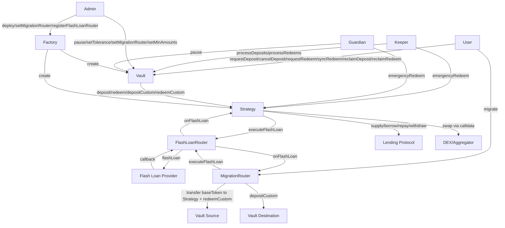

# Contract Decomposition

## Contract Table

| Contract | Responsibility | Depends on |
|----------|---------------|------------|
| Vault | User-facing accounting: ERC20 shares, FIFO epoch queues (partial fills, per-user timeout), NAV calculation, pause logic, sync redeem, reentrancy lock. No emergency/force function — emergency redeem lives on Strategy. | Strategy, MigrationRouter (authorized caller) |
| Strategy (abstract) | Leverage orchestration: flash loan callback, swap execution, lending protocol calls, emergency redeem (called directly by keeper/guardian). Reads actual position from protocol after _forceAccrue (no internal tracking). Receives fraction (1e18-scaled) from Vault for pro-rata operations. Enforces maxLTV on deposit and depositCustom. | FlashLoanRouter, Lending Protocol (external) |
| AaveStrategy | Strategy implementation for Aave v3: supply, borrow, repay, withdraw, _forceAccrue (forceUpdateReserves) | Strategy, Aave v3 (external) |
| MorphoStrategy | Strategy implementation for Morpho Blue: supply, borrow, repay, withdraw, _forceAccrue (accrueInterest) | Strategy, Morpho Blue (external) |
| EulerStrategy | Strategy implementation for Euler v2: supply, borrow, repay, withdraw, _forceAccrue (touch) | Strategy, Euler v2 (external) |
| FlashLoanRouter | Per-provider interface adapter: normalizes flash loan callback. Open access — anyone can call executeFlashLoan(). Validates callback via transient storage (initiator + active flag). Forwards to initiator.onFlashLoan(). No persistent state beyond config. Zero-fee providers only. | Flash loan provider (external) |
| MigrationRouter | Stateless cross-vault migration orchestrator: calls FlashLoanRouter directly, implements onFlashLoan(), transfers baseToken to Strategy before redeemCustom on source, optional YBT conversion, depositCustom on destination | Vault (source + destination), FlashLoanRouter |
| Factory | Deploys vault + strategy pairs, registry, sets MigrationRouter, deployment validation | Vault beacon, Strategy beacons, FlashLoanRouter |

## Interaction Graph

## State Variables

### Vault
- shares — ERC20 balances and totalSupply
- depositQueue — FIFO queue of pending deposit requests (user, amount, timestamp per request)
- redeemQueue — FIFO queue of pending redeem requests with escrowed shares (user, shares, timestamp per request)
- strategy — address of associated Strategy contract
- migrationRouter — authorized MigrationRouter address
- oracle — price oracle for NAV and swap verification
- toleranceBps — max allowed swap slippage in basis points
- minDepositAmount — minimum deposit size
- minRedeemAmount — minimum redeem size (in shares)
- paused — pause state flag
- guardian — guardian address (can pause, call emergencyRedeem on Strategy)
- keeper — keeper address (processes epochs, can call emergencyRedeem on Strategy)
- requestTimeout — duration after which individual unprocessed requests become reclaimable

### Strategy (abstract)
- vault — address of associated Vault contract
- flashLoanRouter — active FlashLoanRouter address
- baseToken — the deposit/debt token address
- ybtToken — the yield-bearing token address
- maxLTV — maximum post-leverage LTV, admin-settable per-vault parameter
- keeper — keeper address (can call emergencyRedeem)
- guardian — guardian address (can call emergencyRedeem)
- No trackedCollateral / trackedDebt — position read from lending protocol via getPosition() after _forceAccrue()

### FlashLoanRouter
- provider — flash loan provider address (configuration, persistent)
- initiator — address that called executeFlashLoan (EIP-1153 transient storage, per-tx only)
- active — flag indicating flash loan in progress (EIP-1153 transient storage, per-tx only)
- No persistent state beyond configuration. Stateless between transactions.

### MigrationRouter
- Stateless — no persistent state (all data passed per-call)

### Factory
- vaultBeacon — beacon address for Vault proxies
- strategyBeacons — beacon address per lending protocol type
- flashLoanRouterBeacons — beacon address per flash loan provider
- migrationRouter — current MigrationRouter address (used for new deployments)
- registry — deployed vault/strategy pair records
- toleranceCeiling — hard ceiling for toleranceBps (100 bps)
