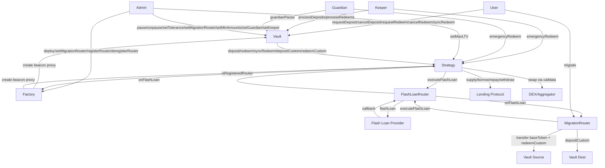

# Contract Decomposition

> GENERATED FROM q-tree.md — do not edit, regenerate from q-tree.

## Contract Table

| Contract | Responsibility | Depends on |
|----------|---------------|------------|
| Vault | User-facing accounting: ERC20 shares, FIFO epoch queues (amount-based partial fills), NAV calculation, pause logic, sync redeem, reentrancy lock (EIP-1153). Cancel is the only mechanism for unprocessed requests (no timeout/reclaim). No forceRedeem — emergency redeem lives on Strategy. | Strategy, Factory (for router registry) |
| Strategy (abstract) | Leverage orchestration: flash loan callback, swap execution with oracle-floor check, lending protocol calls via inheritance. Reads actual position from protocol after _forceAccrue (no internal tracking). Receives fraction (1e18-scaled) from Vault for pro-rata operations. Enforces maxLTV on deposit and depositCustom. emergencyRedeem called directly by keeper/guardian. Does NOT store FlashLoanRouter — receives it as parameter, validates against Factory registry. | FlashLoanRouter (passed per-call), Factory (for router validation), Lending Protocol (external) |
| AaveStrategy | Strategy implementation for Aave v3: supply, borrow, repay, withdraw, _forceAccrue (forceUpdateReserves) | Strategy, Aave v3 (external) |
| MorphoStrategy | Strategy implementation for Morpho Blue: supply, borrow, repay, withdraw, _forceAccrue (accrueInterest) | Strategy, Morpho Blue (external) |
| EulerStrategy | Strategy implementation for Euler v2: supply, borrow, repay, withdraw, _forceAccrue (touch) | Strategy, Euler v2 (external) |
| FlashLoanRouter | Per-provider flash loan adapter: normalizes provider callback to initiator.onFlashLoan(token, amount, fee, data). Open access — anyone can call executeFlashLoan(). Validates callback via transient storage (initiator + active flag). No persistent state beyond config. Zero-fee providers only. | Flash loan provider (external) |
| MigrationRouter | Stateless cross-vault migration orchestrator: calls FlashLoanRouter directly, implements onFlashLoan(), transfers baseToken to Strategy before redeemCustom on source, optional YBT conversion with oracle-floor check, depositCustom on destination. Immutable (no upgradeability). Caller provides FlashLoanRouter address. | Vault (source + destination), FlashLoanRouter, Factory (for router validation) |
| Factory | Deploys Vault + Strategy pairs as beacon proxies, registry of vaults/strategies, admin-managed registry of approved FlashLoanRouters (registerRouter/deregisterRouter/isRegisteredRouter), stores current MigrationRouter for new deployments, deployment validation (oracle reachable, market valid, tolerance <= ceiling, token match). Same admin owns all beacons. Ownable2Step, renounce disabled. | Vault beacon, Strategy beacons |

## Interaction Graph

## State Variables

### Vault
- shares — ERC20 balances and totalSupply (18-decimal)
- depositQueue — FIFO queue of pending deposit requests (user, amount, filledAmount per request)
- redeemQueue — FIFO queue of pending redeem requests with escrowed shares (user, shares, filledShares per request)
- depositQueueHead — pointer to first unprocessed deposit request in FIFO
- redeemQueueHead — pointer to first unprocessed redeem request in FIFO
- strategy — address of associated Strategy contract
- factory — address of Factory (for FlashLoanRouter registry validation)
- migrationRouter — authorized MigrationRouter address (set by factory, updatable by admin)
- oracle — price oracle for NAV and swap verification
- toleranceBps — max allowed swap slippage in basis points (ceiling 100 bps)
- minDepositAmount — minimum deposit size (admin-settable)
- minRedeemAmount — minimum redeem size in shares (admin-settable)
- paused — pause state flag
- guardian — guardian address (can pause)
- keeper — keeper address (processes epochs)

### Strategy (abstract)
- vault — address of associated Vault contract
- factory — address of Factory (for FlashLoanRouter registry validation)
- baseToken — the deposit/debt token address
- ybtToken — the yield-bearing token address
- maxLTV — maximum post-leverage LTV, admin-settable per-vault parameter
- keeper — keeper address (can call emergencyRedeem)
- guardian — guardian address (can call emergencyRedeem)
- No flashLoanRouter storage — received as parameter per-call, validated against Factory registry
- No trackedCollateral / trackedDebt — position read from lending protocol via getPosition() after _forceAccrue()

### FlashLoanRouter
- provider — flash loan provider address (configuration, persistent)
- initiator — address that called executeFlashLoan (EIP-1153 transient storage, per-tx only)
- active — flag indicating flash loan in progress (EIP-1153 transient storage, per-tx only)
- No persistent state beyond configuration. Stateless between transactions.

### MigrationRouter
- factory — address of Factory (for FlashLoanRouter registry validation)
- No other persistent state — all data passed per-call

### Factory
- vaultBeacon — beacon address for Vault proxies
- strategyBeacons — beacon address per lending protocol type
- registeredRouters — admin-managed set of approved FlashLoanRouter addresses
- migrationRouter — current MigrationRouter address (used for new deployments)
- registry — deployed vault/strategy pair records
- toleranceCeiling — hard ceiling for toleranceBps (100 bps)
- owner — admin (Ownable2Step, renounce disabled)
