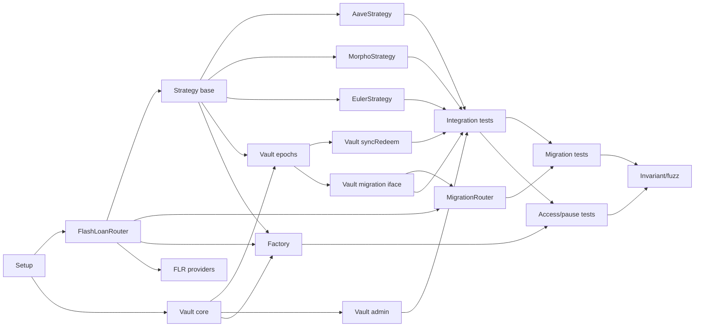

# Development Plan

> GENERATED FROM q-tree.md — do not edit, regenerate from q-tree.

## Tasks

| # | Task | Contract | Depends on | Traceable to |
|---|------|----------|------------|-------------|
| 1 | Project setup (Foundry, fork tests, OZ deps, base test helpers) | — | — | — |
| 2 | FlashLoanRouter base: executeFlashLoan, transient storage (initiator + active flag), callback validation, zero-fee enforcement | FlashLoanRouter | 1 | d:flash-callback, d:flr-invariants, d:flr-state, d:flr-access |
| 3 | Strategy abstract base: deposit, redeem, syncRedeem, depositCustom, redeemCustom, emergencyRedeem, onFlashLoan, fraction logic, oracle-floor swap check, maxLTV check, _forceAccrue/_getPosition/_supply/_borrow/_repay/_withdraw virtual hooks, Factory registry validation for flashLoanRouter parameter | Strategy | 1, 2 | d:contracts, d:orchestration, d:leverage-flow, d:fraction-arg, d:invariant, d:max-ltv, d:accrue-before-snap, d:flr-selection |
| 4 | AaveStrategy: Aave v3 supply/borrow/repay/withdraw, _forceAccrue (forceUpdateReserves), _getPosition | AaveStrategy | 3 | d:contract-list, d:adapter-ownership |
| 5 | MorphoStrategy: Morpho Blue supply/borrow/repay/withdraw, _forceAccrue (accrueInterest), _getPosition | MorphoStrategy | 3 | d:contract-list, d:adapter-ownership |
| 6 | EulerStrategy: Euler v2 supply/borrow/repay/withdraw, _forceAccrue (touch), _getPosition | EulerStrategy | 3 | d:contract-list, d:adapter-ownership |
| 7 | Vault core: ERC20 shares, FIFO deposit/redeem queues with partial fills, requestDeposit, cancelDeposit, requestRedeem, cancelRedeem, minimum amounts, pause/unpause | Vault | 1 | d:accounting, d:cancel, d:partial-epoch, d:epoch-separation, d:min-amounts, d:pause-scope, d:naming |
| 8 | Vault epoch processing: processDeposits (delta NAV mint), processRedeems (fraction-based unwind, burn, distribute), _forceAccrue calls, reentrancy lock, FlashLoanRouter parameter validation against Factory registry | Vault | 3, 7 | d:nav-snap, d:epoch-separation, d:partial-epoch, d:reentrancy-lock, d:accrue-before-snap, d:rounding, d:flr-selection |
| 9 | Vault syncRedeem: fraction computation, burn shares, Strategy.syncRedeem call, idle mode path, works when paused, FlashLoanRouter parameter validation against Factory registry | Vault | 3, 7, 8 | d:sync-redeem, d:sync-idle, d:pause-exit, d:flr-selection |
| 10 | Vault migration interface: depositCustom (arithmetic NAV validation, mint shares), redeemCustom (fraction, burn shares, no pending redeem check) | Vault | 3, 7, 8 | d:migration-deposit, d:dc-signature, d:dc-access, d:dc-oracle, d:arith-nav, d:redeem-custom-flow |
| 11 | Vault admin: setTolerance, setMigrationRouter, setMinDepositAmount, setMinRedeemAmount, setGuardian, setKeeper, guardianPause, Ownable2Step (renounce disabled), NAV/totalAssets view | Vault | 7 | d:tolerance-params, d:access-details, d:admin-transfer |
| 12 | MigrationRouter: migrate, onFlashLoan callback, flash loan amount computation, baseToken transfer to Strategy before redeemCustom, optional YBT conversion with oracle-floor check, FlashLoanRouter parameter validation against Factory registry | MigrationRouter | 2, 10 | d:migration, d:migration-auth, d:migration-flash-source, d:migration-flash-amount, d:migration-verify, d:redeem-custom-flow, d:partial-migration, d:flr-selection |
| 13 | Factory: deploy (beacon proxy creation, vault-strategy linking, on-chain validation), setMigrationRouter, setStrategyBeacon, setVaultBeacon, registerRouter/deregisterRouter/isRegisteredRouter, registry | Factory | 7, 3, 2 | d:factory-validation, d:new-protocol, d:new-flashloan, d:vault-beacon, d:beacon-owner, d:flr-selection |
| 14 | FlashLoanRouter provider implementations: Aave, Balancer, Morpho (per-provider callback normalization) | FlashLoanRouter subclasses | 2 | d:flr-callbacks, d:flash-fee |
| 15 | Strategy-Vault integration tests: full deposit epoch, full redeem epoch, sync redeem, idle mode, emergency redeem flow | All | 4-11 | d:leverage-flow, d:accounting, d:sync-redeem, d:keeper-emergency |
| 16 | Migration integration tests: full migration flow, partial migration, different YBT conversion, same-debt-token check | All | 12, 15 | d:migration, d:partial-migration, d:migration-verify |
| 17 | Access control + pause tests: role checks, pause behavior, Ownable2Step, FlashLoanRouter registry validation | All | 8-13 | d:access-details, d:pause-scope, d:pause-auth, d:flr-selection |
| 18 | Invariant / fuzz tests: FIFO ordering, rounding, oracle-floor, reentrancy lock, no-residual flash loan, donation resistance | All | 15-17 | d:invariant, d:rounding, d:internal-tracking, d:first-depositor, d:flr-invariants |

## Order

Build bottom-up: flash loan infra -> strategy -> vault -> routers -> factory -> integration tests.

## Completeness Check

Every contract from contracts.md and every function from interfaces maps to a task:

- **Vault**: requestDeposit, cancelDeposit, requestRedeem, cancelRedeem (task 7); processDeposits, processRedeems (task 8); syncRedeem (task 9); depositCustom, redeemCustom (task 10); pause, unpause, guardianPause, setTolerance, setMigrationRouter, setMinDepositAmount, setMinRedeemAmount, setGuardian, setKeeper, totalAssets (task 11)
- **Strategy**: deposit, redeem, syncRedeem, depositCustom, redeemCustom, emergencyRedeem, onFlashLoan, setMaxLTV, getPosition (task 3). No setFlashLoanRouter — flashLoanRouter is a parameter, not stored.
- **AaveStrategy**: _supply, _borrow, _repay, _withdraw, _forceAccrue, _getPosition (task 4)
- **MorphoStrategy**: (task 5)
- **EulerStrategy**: (task 6)
- **FlashLoanRouter**: executeFlashLoan, provider (task 2); per-provider callbacks (task 14)
- **MigrationRouter**: migrate, onFlashLoan (task 12)
- **Factory**: deploy, setMigrationRouter, setStrategyBeacon, setVaultBeacon, registerRouter, deregisterRouter, isRegisteredRouter, isRegistered (task 13)
