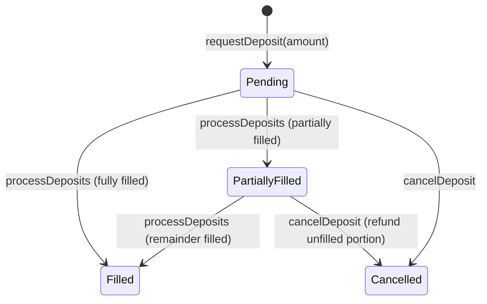
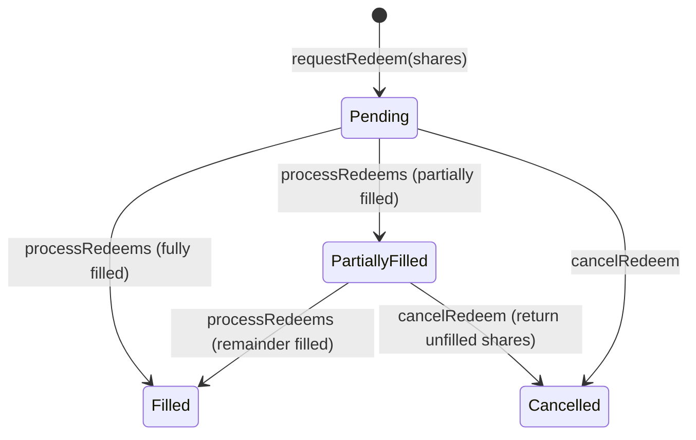
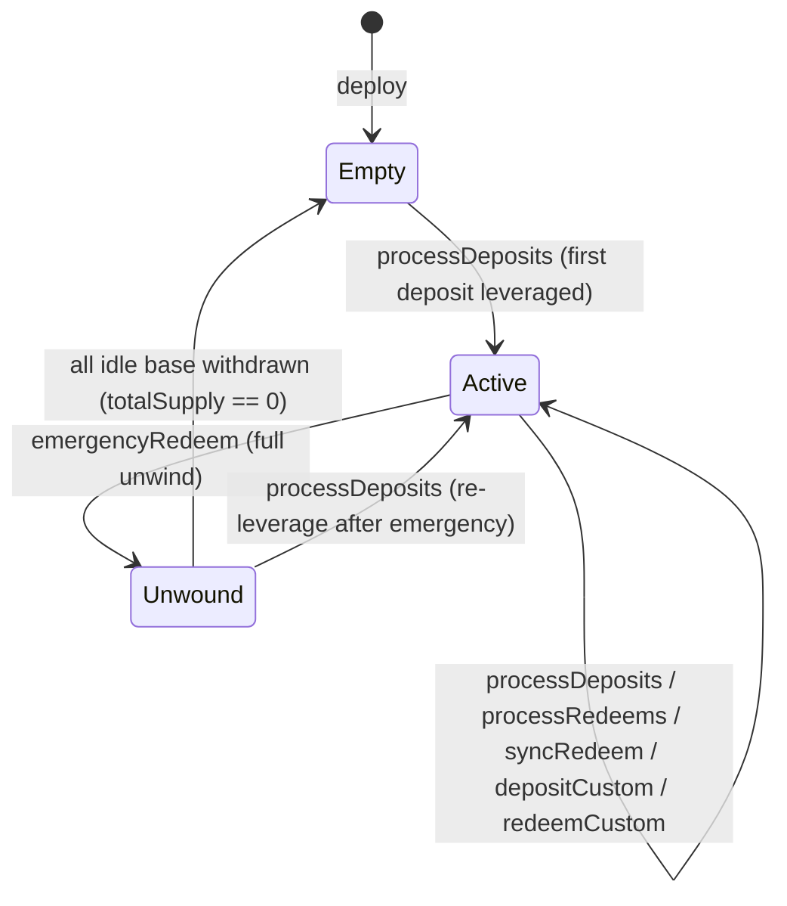

# State Machines

> GENERATED FROM q-tree.md — do not edit, regenerate from q-tree.

## Deposit Request

States: `Pending`, `PartiallyFilled`, `Filled`, `Cancelled`

| From | To | Trigger | Guard |
|------|----|---------|-------|
| * | Pending | requestDeposit(amount) | not paused, amount >= minDepositAmount |
| Pending | Filled | processDeposits | keeper, request reached by FIFO, fully covered by amount arg |
| Pending | PartiallyFilled | processDeposits | keeper, request is last in batch, only partially covered by amount arg |
| Pending | Cancelled | cancelDeposit(requestId) | msg.sender is request owner |
| PartiallyFilled | Filled | processDeposits | keeper, remainder covered by next batch amount |
| PartiallyFilled | Cancelled | cancelDeposit(requestId) | msg.sender is request owner, refund = amount - filledAmount |

State invariants:
- Pending: base tokens held idle in vault, no shares issued, filledAmount == 0
- PartiallyFilled: some shares already minted for filled portion, filledAmount > 0 and < amount
- Filled: all shares minted, request fully processed (terminal)
- Cancelled: unfilled base tokens returned to user (terminal)

## Redeem Request

States: `Pending`, `PartiallyFilled`, `Filled`, `Cancelled`

| From | To | Trigger | Guard |
|------|----|---------|-------|
| * | Pending | requestRedeem(shares) | not paused, shares >= minRedeemAmount |
| Pending | Filled | processRedeems | keeper, request reached by FIFO, fully covered by shares arg |
| Pending | PartiallyFilled | processRedeems | keeper, request is last in batch, only partially covered by shares arg |
| Pending | Cancelled | cancelRedeem(requestId) | msg.sender is request owner |
| PartiallyFilled | Filled | processRedeems | keeper, remainder covered by next batch shares |
| PartiallyFilled | Cancelled | cancelRedeem(requestId) | msg.sender is request owner, return unfilled shares from escrow |

State invariants:
- Pending: shares escrowed in vault (transferred from user), filledShares == 0, user cannot syncRedeem these shares
- PartiallyFilled: base tokens already distributed for filled portion, filledShares > 0 and < shares, remaining shares still escrowed
- Filled: all base tokens distributed, all escrowed shares burned (terminal)
- Cancelled: unfilled escrowed shares returned to user (terminal)

## Vault Position

States: `Empty`, `Active`, `Unwound`

| From | To | Trigger | Guard |
|------|----|---------|-------|
| * | Empty | Factory.deploy | admin |
| Empty | Active | processDeposits | keeper, first leveraged deposit |
| Active | Active | processDeposits / processRedeems / syncRedeem / depositCustom / redeemCustom | normal operations, position still open |
| Active | Unwound | emergencyRedeem | keeper or guardian, fraction = 1e18 |
| Unwound | Empty | last user syncRedeems remaining idle | totalSupply reaches 0 |
| Unwound | Active | processDeposits | keeper re-leverages after emergency |

State invariants:
- Empty: collateral == 0, debt == 0, totalSupply == 0 (or only idle base from pending deposits)
- Active: collateral > 0, debt > 0, LTV <= maxLTV
- Unwound: collateral == 0, debt == 0, idle base > 0, totalSupply > 0; syncRedeem uses idle mode (no flash loan)
