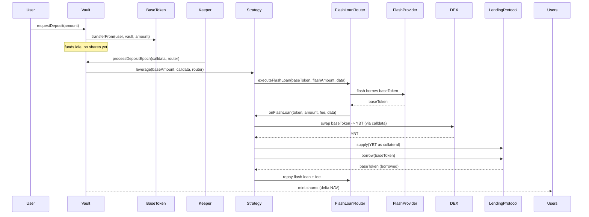
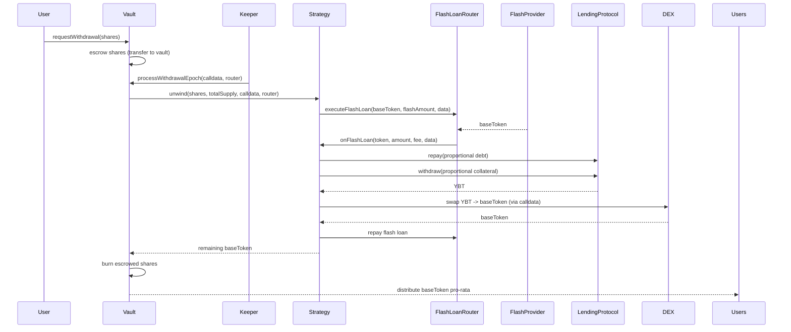
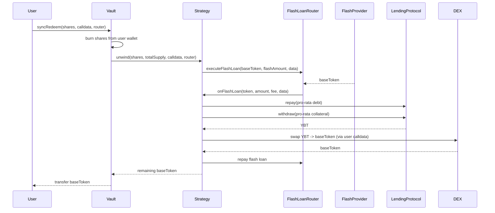
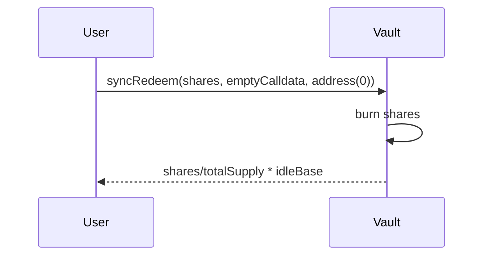
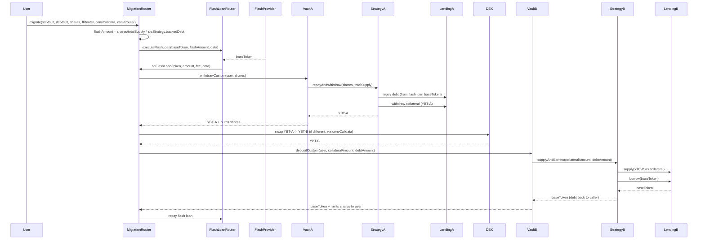
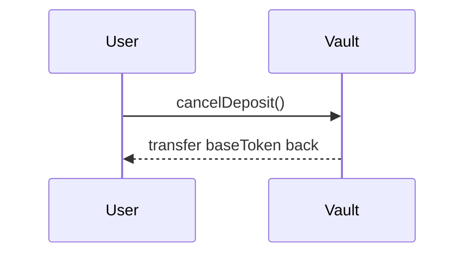
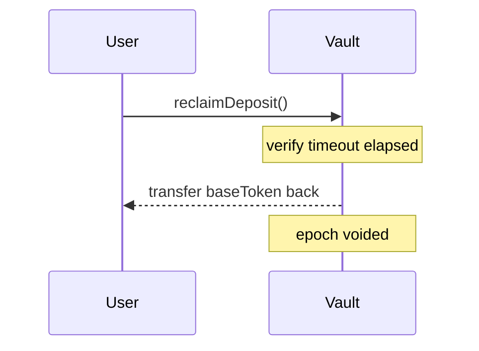
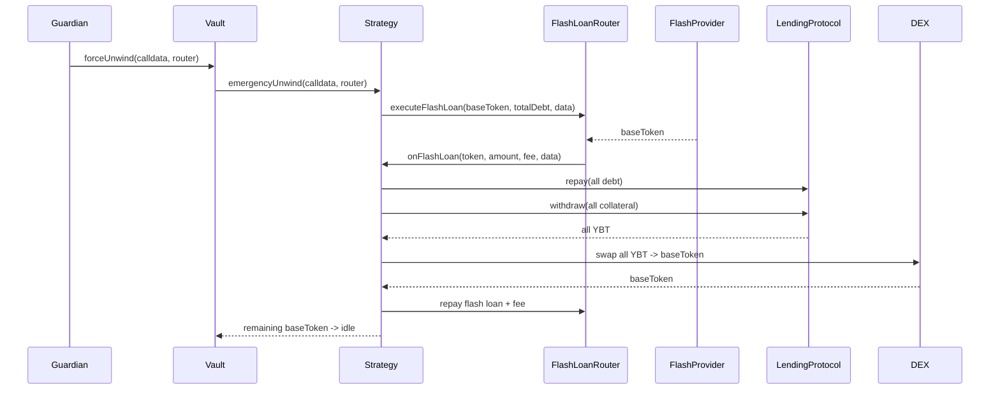

# Token Flows

## Deposit (async epoch)

baseToken: User -> Vault (idle) -> Strategy -> DEX (swap to YBT) -> LendingProtocol (collateral). LendingProtocol -> Strategy (borrow baseToken) -> FlashLoanRouter (repay).

## Async Withdrawal (keeper epoch)

LendingProtocol -> Strategy (withdraw YBT collateral) -> DEX (swap to baseToken) -> Vault -> Users.

## Sync Permissionless Redeem

Same as async withdrawal but user-initiated with user-provided calldata. User pays gas + slippage. Always available even when paused.

## Sync Redeem (Idle Mode)

When position is fully unwound (zero collateral, zero debt), skip flash loan, return pro-rata idle base.

## Migration (cross-strategy)

Source: shares burned, collateral withdrawn, debt repaid. Destination: collateral supplied, debt borrowed, shares minted. Flash loan bridges the debt repayment. MigrationRouter calls FlashLoanRouter directly (not via Strategy).

## Cancel Pending Deposit

baseToken: Vault -> User. No shares were ever minted.

## Reclaim After Keeper Timeout

baseToken: Vault -> User. Epoch voided after timeout.

## Force-Unwind

Full position unwind to idle base. After this, users exit via sync redeem idle mode.
