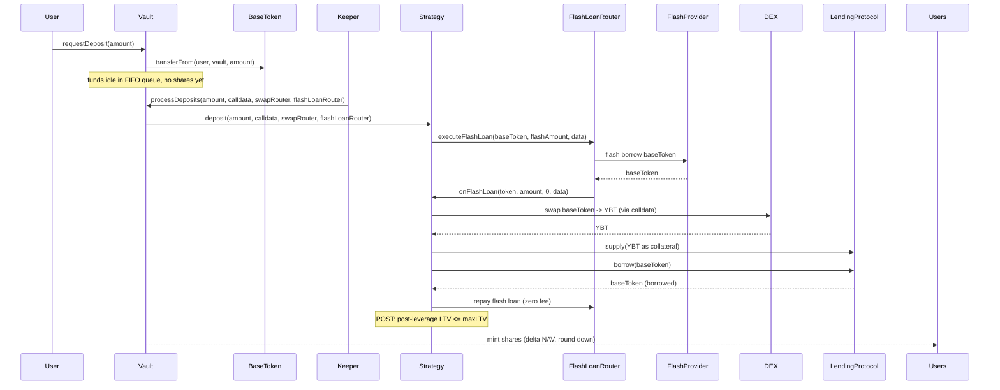
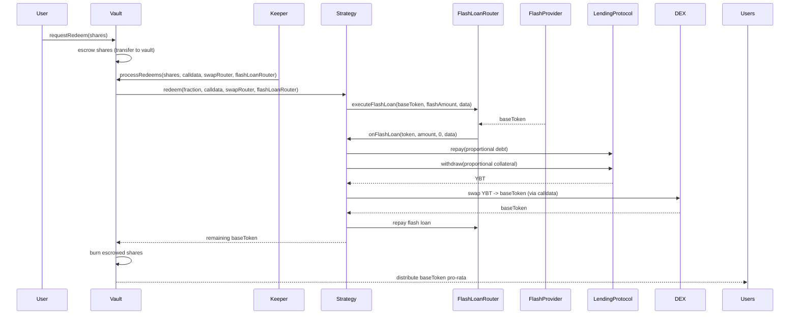
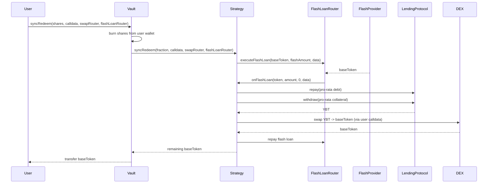
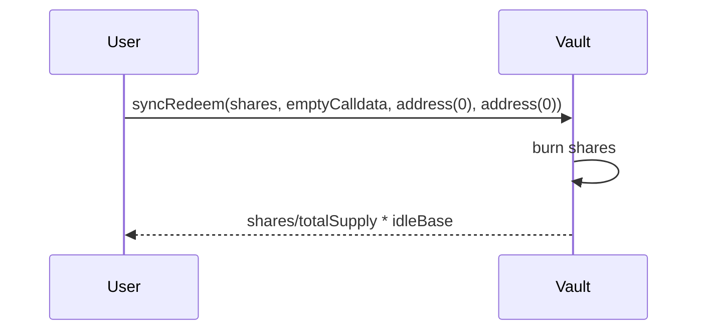
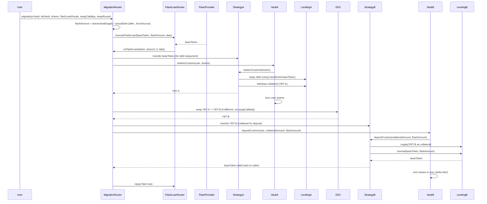
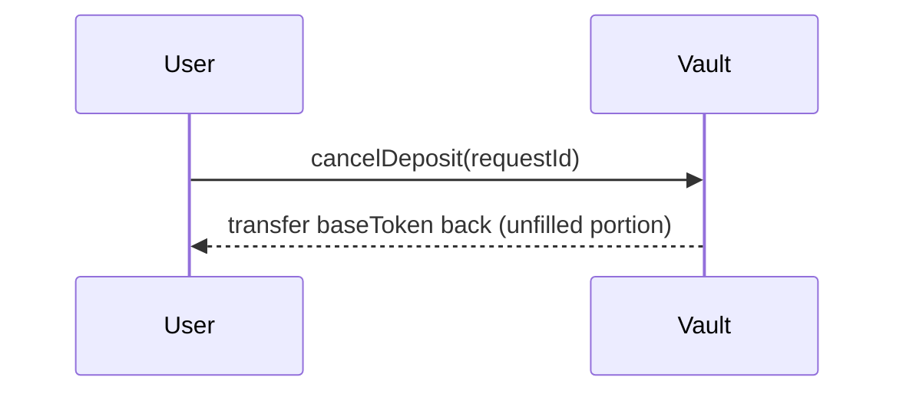
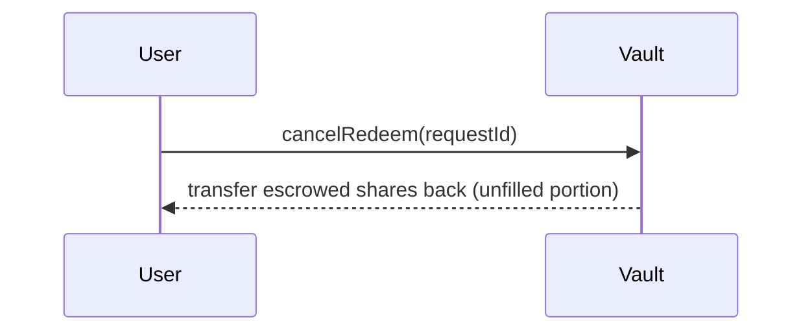
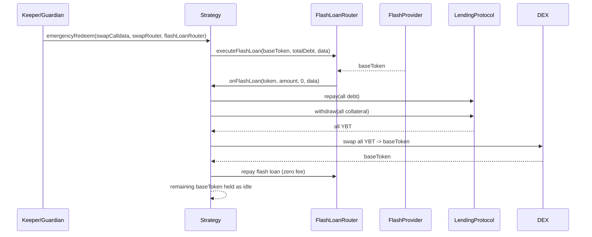

# Token Flows

> GENERATED FROM q-tree.md — do not edit, regenerate from q-tree.

## Deposit (async epoch)

baseToken: User -> Vault (idle) -> Strategy -> DEX (swap to YBT) -> LendingProtocol (collateral). LendingProtocol -> Strategy (borrow baseToken) -> FlashLoanRouter (repay). Keeper specifies amount in base token; contract iterates FIFO from head, filling requests until amount exhausted. Last request may be partially filled. FlashLoanRouter validated against Factory registry.

## Async Redeem (keeper epoch)

LendingProtocol -> Strategy (withdraw YBT collateral) -> DEX (swap to baseToken) -> Vault -> Users. Keeper specifies shares to unwind; contract iterates FIFO from head consuming requests until shares exhausted. FlashLoanRouter provided by keeper per-call, validated against Factory registry.

## Sync Permissionless Redeem

Same as async redeem but user-initiated with user-provided calldata. Vault computes fraction = shares * 1e18 / totalSupply. User pays gas + slippage. Always available even when paused. User provides flashLoanRouter, validated against Factory registry.

## Sync Redeem (Idle Mode)

When position is fully unwound (zero collateral, zero debt), skip flash loan, return pro-rata idle base.

## Migration (cross-strategy)

Source: MigrationRouter transfers baseToken to Strategy before redeemCustom. Shares burned, collateral withdrawn, debt repaid. Destination: collateral supplied, debt borrowed (debtAmount = flashAmount), shares minted. Flash loan bridges the debt repayment. MigrationRouter calls FlashLoanRouter directly (not via Strategy). debtAmount passed to depositCustom is the flash loan amount. Caller provides flashLoanRouter, validated against Factory registry.

## Cancel Pending Deposit

baseToken: Vault -> User. No shares were ever minted for the unfilled portion. Cancel is the only mechanism for unprocessed requests — no reclaim, no timeout.

## Cancel Pending Redeem

Escrowed shares: Vault -> User. Cancel is the only mechanism for unprocessed requests — no reclaim, no timeout.

## Emergency Redeem

Full position unwind to idle base. Keeper or guardian calls Strategy.emergencyRedeem() directly (not through Vault). Uses fraction = 1e18 (full position). After this, users exit via sync redeem idle mode. FlashLoanRouter provided per-call, validated against Factory registry by Strategy.
